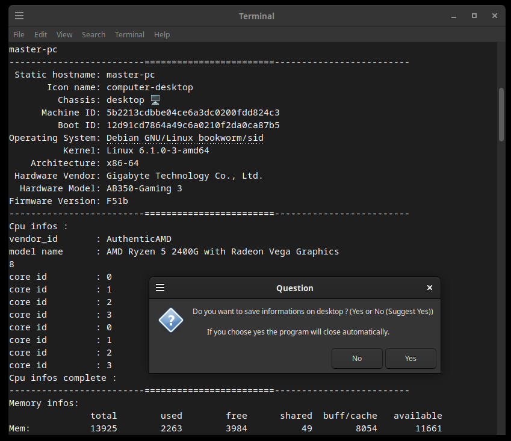

# SCANINFO

ScanInfo linux debian bash, informations about your hardware and configurations.

SCANINFO informations about your system in bash
--------------------------------------------------------------------

THIS IS A WORK IN PROGRESS

FREE Linux Bash software by LostByteSoft

No CopyRIGHT or CopyLEFT, i am just in the CENTER. That not perfect but me neither.

SCANINFO list help tool.

Debian linux (and related) bash system info grabber.

Show your hardware informaions in bash and create text for future reference.

Things do !
--------------------------------------------------------------------

* Check_sha512.sh auto load *.sha512 file if exist.
* Select the good hash (good line) in file if many is present.

Files and use
--------------------------------------------------------------------

-SCANINFO list HARDWARE.sh

	Show general informations about your HARDWARE system.

SCANINFO list HDD space.sh

	Show informations about your HARD DRIVES & SSD.

SCANINFO list LAN card.sh

	Show informations about your LAN card and ADRESSES (IP).

---TO DO---

SCANINFO list SOFT(wares)

SCANINFO anything else ?

Screenshot (Partial)
--------------------------------------------------------------------

SCANINFO list HARDWARE

SCANINFO list HDD space

SCANINFO list LAN card

FREE Linux Bash software by LostByteSoft

--------------------------------------------------------------------

	JUST DO WHAT YOU WANT WITH THE PUBLIC LICENSE

	Version 3.1415926532 (January 2022)

	TERMS AND CONDITIONS FOR COPYING, DISTRIBUTION AND MODIFICATION
   
	Everyone is permitted to copy and distribute verbatim or modified copies of
	this license document.

	As is customary and in compliance with current global and interplanetary
	regulations, the author of these pages disclaims all liability for the
	consequences of the advice given here, in particular in the event of partial
	or total destruction of the material, Loss of rights to the manufacturer
	warranty, electrocution, drowning, divorce, civil war, the effects of radiation
	due to atomic fission, unexpected tax recalls or encounters with
	extraterrestrial beings elsewhere.

	LostByteSoft no copyright or copyleft we are in the center.

 	You can send your request and your Christmas wishes to this address:
 	
 		Père Noël
 		Pôle Nord, Canada
 		H0H 0H0

--------------------------------------------------------------------
# --- End of file ---
